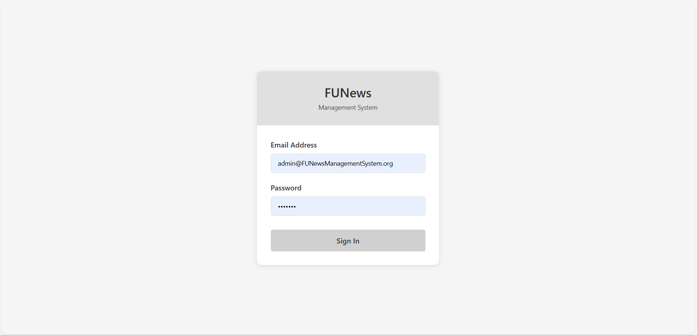
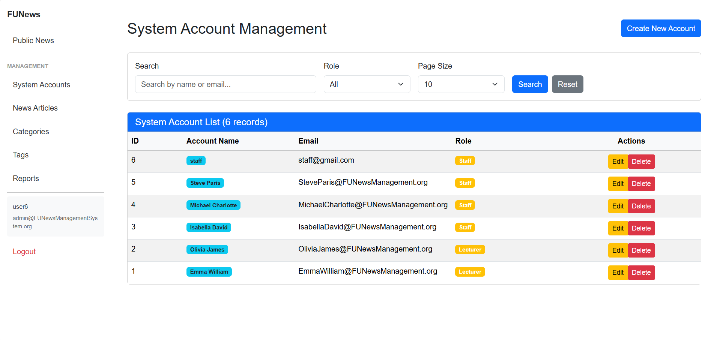
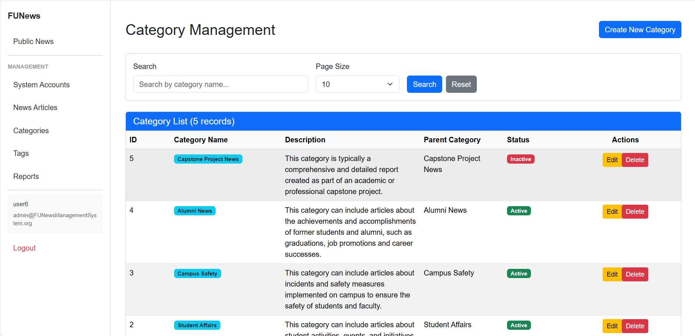
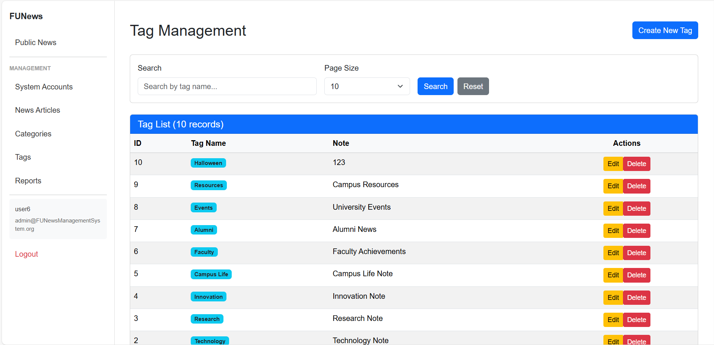
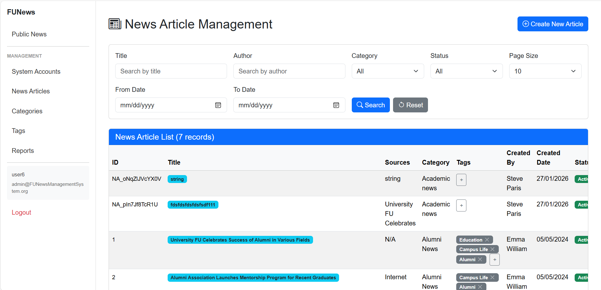
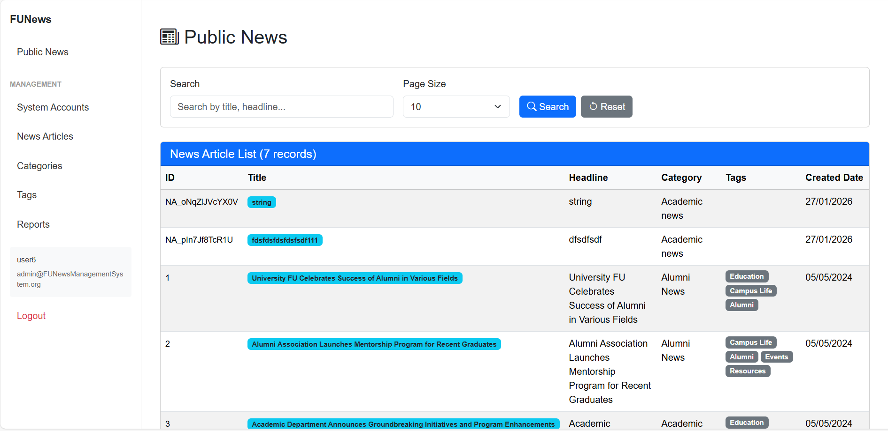
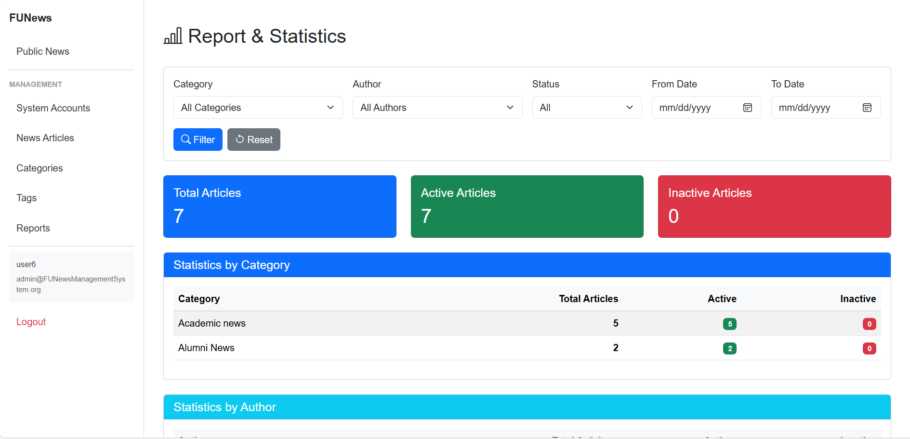

# FUNews Management System

## Cách chạy project

### 1. Yêu cầu
- .NET 6.0 SDK trở lên
- SQL Server
- Visual Studio 2022 hoặc VS Code

### 2. Cấu hình Database
- Mở file `NguyenDucManh_SE1884_A01_BE/NguyenDucManh_SE1884_A01_BE/appsettings.json`
- Cập nhật connection string phù hợp với SQL Server của bạn
- Database sẽ tự động được tạo khi chạy project lần đầu (Code First)

### 3. Chạy Backend API
**Cách 1: Dùng Visual Studio**
- Mở solution `NguyenDucManh_SE1884_A01_BE/NguyenDucManh_SE1884_A01_BE.sln`
- Nhấn F5 hoặc Run

**Cách 2: Dùng Command Line**
```bash
cd NguyenDucManh_SE1884_A01_BE\NguyenDucManh_SE1884_A01_BE
dotnet run
```
Backend sẽ chạy tại: `https://localhost:7053`

### 4. Chạy Frontend MVC
**Cách 1: Dùng Visual Studio**
- Mở solution `NguyenDucManh_SE1884_A01_FE/NguyenDucManh_SE1884_A01_FE.sln`
- Nhấn F5 hoặc Run

**Cách 2: Dùng Command Line**
```bash
cd NguyenDucManh_SE1884_A01_FE\NguyenDucManh_SE1884_A01_FE
dotnet run
```
Frontend sẽ chạy tại: `https://localhost:7001`

**Lưu ý:** Cần chạy Backend trước, sau đó mới chạy Frontend

### 5. Đăng nhập
**Admin Account:**
- Email: admin@FUNewsManagementSystem.org
- Password: @@123@@

**Staff Account:**
- Email: IsabellaDavid@FUNewsManagement.org
- Password: @1

**Lecturer Account:**
- Email: OliviaJames@FUNewsManagement.org
- Password: @1

## Danh sách API

### SystemAccounts API
**Base URL:** `/api/systemaccounts`

| Method | Endpoint | Auth | Description |
|--------|----------|------|-------------|
| GET | `/` | Admin | Lấy danh sách account (phân trang) |
| GET | `/all` | Admin | Lấy tất cả account |
| GET | `/{id}` | Admin | Lấy account theo ID |
| POST | `/create-or-edit` | Admin | Tạo hoặc cập nhật account |
| DELETE | `/{id}` | Admin | Xóa account |
| POST | `/login` | Public | Đăng nhập |

**Query Parameters (GET /):**
- `PageIndex`: Trang hiện tại
- `PageSize`: Số bản ghi mỗi trang
- `Keyword`: Tìm kiếm theo tên hoặc email
- `AccountRole`: Lọc theo role (0=Admin, 1=Staff, 2=Lecturer)

---

### NewsArticles API
**Base URL:** `/api/newsarticles`

| Method | Endpoint | Auth | Description |
|--------|----------|------|-------------|
| GET | `/` | Admin,Staff | Lấy danh sách bài viết (phân trang) |
| GET | `/public` | Public | Lấy bài viết công khai |
| GET | `/all` | Admin,Staff | Lấy tất cả bài viết |
| GET | `/{id}` | Admin,Staff | Lấy bài viết theo ID |
| POST | `/create-or-edit` | Admin,Staff | Tạo hoặc cập nhật bài viết |
| POST | `/{id}/duplicate` | Admin,Staff | Nhân bản bài viết |
| DELETE | `/{id}` | Admin,Staff | Xóa bài viết |
| POST | `/{id}/tags/{tagId}` | Admin,Staff | Thêm tag vào bài viết |
| DELETE | `/{id}/tags/{tagId}` | Admin,Staff | Xóa tag khỏi bài viết |

**Query Parameters (GET /):**
- `PageIndex`: Trang hiện tại
- `PageSize`: Số bản ghi mỗi trang
- `Title`: Tìm kiếm theo tiêu đề
- `Author`: Tìm kiếm theo tác giả
- `CategoryId`: Lọc theo category
- `Status`: Lọc theo trạng thái (true/false)
- `FromDate`: Lọc từ ngày
- `ToDate`: Lọc đến ngày
- `CreatedById`: Lọc theo người tạo

---

### Categories API
**Base URL:** `/api/categories`

| Method | Endpoint | Auth | Description |
|--------|----------|------|-------------|
| GET | `/` | Staff | Lấy danh sách category (phân trang) |
| GET | `/all` | Public | Lấy tất cả category |
| GET | `/{id}` | Staff | Lấy category theo ID |
| POST | `/create-or-edit` | Staff | Tạo hoặc cập nhật category |
| DELETE | `/{id}` | Staff | Xóa category |

**Query Parameters (GET /):**
- `PageIndex`: Trang hiện tại
- `PageSize`: Số bản ghi mỗi trang
- `Keyword`: Tìm kiếm theo tên

---

### Tags API
**Base URL:** `/api/tags`

| Method | Endpoint | Auth | Description |
|--------|----------|------|-------------|
| GET | `/` | Staff | Lấy danh sách tag (phân trang) |
| GET | `/all` | Public | Lấy tất cả tag |
| GET | `/{id}` | Staff | Lấy tag theo ID |
| POST | `/create-or-edit` | Staff | Tạo hoặc cập nhật tag |
| DELETE | `/{id}` | Staff | Xóa tag |

**Query Parameters (GET /):**
- `PageIndex`: Trang hiện tại
- `PageSize`: Số bản ghi mỗi trang
- `Keyword`: Tìm kiếm theo tên

---

### Report API
**Base URL:** `/api/report`

| Method | Endpoint | Auth | Description |
|--------|----------|------|-------------|
| GET | `/news-article-report` | Admin | Lấy báo cáo thống kê bài viết |

**Query Parameters:**
- `FromDate`: Từ ngày
- `ToDate`: Đến ngày

---

## Phân quyền

### Admin
- Quản lý System Account
- Quản lý News Article (tất cả)
- Quản lý Category
- Quản lý Tag
- Xem Report

### Staff
- Quản lý News Article (tất cả)
- Xem My Articles (chỉ bài viết của mình)
- Quản lý Category
- Quản lý Tag

### Public
- Xem Public News (bài viết có category active)

---

## Cấu trúc Project

```
NguyenDucManh_SE1884_A01/
├── NguyenDucManh_SE1884_A01_BE/        # Backend Solution
│   ├── NguyenDucManh_SE1884_A01_BE.sln
│   └── NguyenDucManh_SE1884_A01_BE/   # Backend API Project
│       ├── Controllers/               # API Controllers
│       ├── Services/                  # Business Logic
│       ├── Repositories/              # Data Access
│       ├── Models/                    # Entity Models
│       ├── Dto/                       # Data Transfer Objects
│       └── Data/                      # DbContext
│
├── NguyenDucManh_SE1884_A01_FE/        # Frontend Solution
│   ├── NguyenDucManh_SE1884_A01_FE.sln
│   └── NguyenDucManh_SE1884_A01_FE/   # Frontend MVC Project
│       ├── Controllers/               # MVC Controllers
│       ├── Views/                     # Razor Views
│       ├── Services/                  # API Client Services
│       └── wwwroot/                   # Static files
│
└── README.md
```

---

## Tính năng chính

1. **Authentication & Authorization**: Cookie-based authentication với role-based authorization
2. **News Article Management**: CRUD, search, filter, duplicate, tag management
3. **Category Management**: CRUD với validation (không xóa nếu có bài viết)
4. **Tag Management**: CRUD với validation (không xóa nếu đang được sử dụng)
5. **System Account Management**: CRUD với validation email unique
6. **Report**: Thống kê bài viết theo category và author
7. **My Articles**: Staff xem lịch sử bài viết của mình
8. **Public News**: Hiển thị bài viết công khai cho người dùng chưa đăng nhập

---

## Screenshots

### Login


### System Account Management


### Category Management


### Tag Management


### News Article Management


### Public News


### Report

# FUNewsManagement
